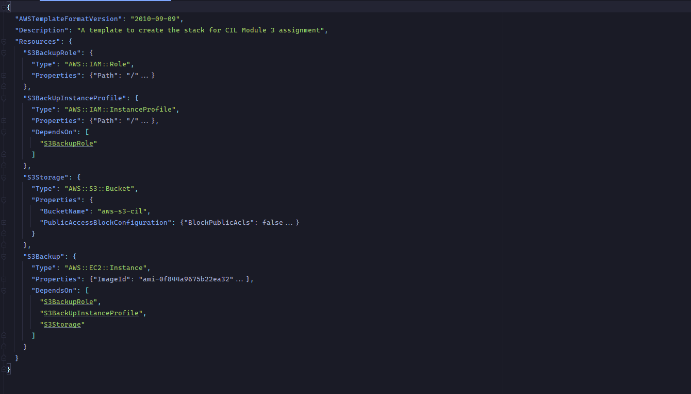
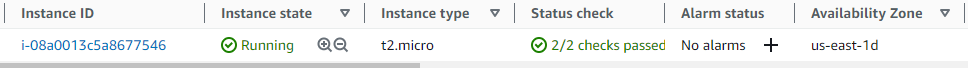

# CIL-Assignment-1

## Description
A repo for my first CIL Cloud Engineering Assignment

# Problem Statement

- Create a CloudFormation (CFN) stack that launches a t2.micro EC2 instance (Amazon Linux 2 AMI)
and an S3 bucket.
- Give the EC2 instance a role that allows it to be accessed via the Session Manager (SSM) instead
of via SSH with key-pairs.
- Set up the EC2 instance to act as a backup for images uploaded to the S3 bucket. The backup should be done
to a folder `/home/user/myS3backup`.
- Write a python script that copies the S3 content to the backup directory
- Set up a cronjob that runs the python script at least once every day at any time of choice.

> ## Cloud Formation
> CloudFormation is an AWS service that implements [Infrastructure as Code](https://en.wikipedia.org/wiki/Infrastructure_as_code).
It allows users to define and provision AWS infrastructure resources using declarative JSON or YAML templates.
> This allows the infrastructure to be treated as code which can be shared between developers and can be versioned and stored using 
Version Control Systems (VCS). 

> ## EC2 
> Amazon Elastic Compute Cloud (EC2) provides compute capacity for users and other services in the AWS Cloud. It is a virtual machine
> which can be provisioned with various operating systems and compute capacities as required. Creating EC2 instances in the cloud
> allows for users to create only the number of instances they need and scale up or out quickly.

