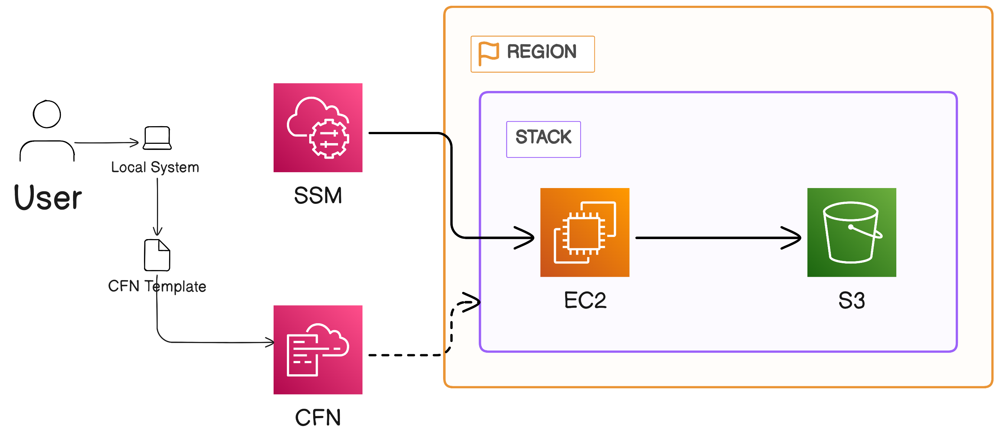
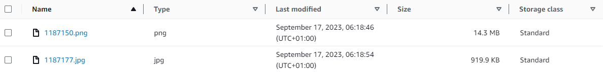
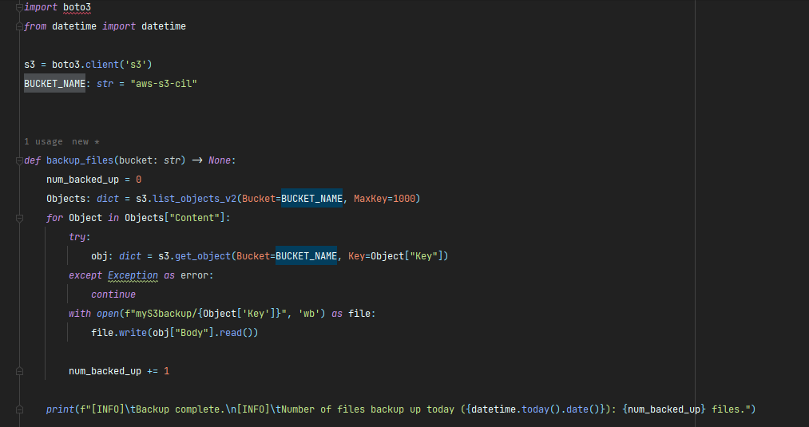

# CIL-Assignment-1

## Description
A repo for my first CIL Cloud Engineering Assignment

# Problem Statement

- Create a CloudFormation (CFN) stack that launches a t2.micro EC2 instance (Amazon Linux 2 AMI)
and an S3 bucket.
- Give the EC2 instance a role that allows it to be accessed via the Session Manager (SSM) instead
of via SSH with key-pairs.
- Set up the EC2 instance to act as a backup for images uploaded to the S3 bucket. The backup should be done
to a folder `/home/user/myS3backup`.
- Write a python script that copies the S3 content to the backup directory
- Set up a cronjob that runs the python script at least once every day at any time of choice.

# Architectural Diagram

> ## Cloud Formation
> CloudFormation is an AWS service that implements [Infrastructure as Code](https://en.wikipedia.org/wiki/Infrastructure_as_code).
It allows users to define and provision AWS infrastructure resources using declarative JSON or YAML templates.
> This allows the infrastructure to be treated as code which can be shared between developers and can be versioned and stored using 
Version Control Systems (VCS). The main advantages of this is the reproducibility of the entire stack which can be torn down
> and created with ease or have multiple versions of it created using parameterization for different stages such as dev and production.

> ## EC2 
> Amazon Elastic Compute Cloud (EC2) provides compute capacity for users and other services in the AWS Cloud. It is a virtual machine
> which can be provisioned with various operating systems and compute capacities as required. Creating EC2 instances in the cloud
> allows for users to create only the number of instances they need and scale up or out quickly.

> ## IAM Role
> An IAM Role is an AWS Identity that has permissions to perform specific actions. It is similar to an IAM User but is not uniquely associated with one
> person. Instead, is it intended to be assumable by anyone or any services that needs to perform the actions the role allows.

> ## S3
> AWS Simple Storage Service (S3) is an object storage service. Individual files are stored as objects and changes made to the files
> are not incrementally added. Instead, when changes to a file are made, a new version of the entire file must be created and stored.

> ## Python Script
> The python script was written using the AWS SDK for python (Boto3).
> An S3 client was created using the code `s3 = boto3.client('s3')`.  
> The function list object method `s3.list_objects_v2(Bucket=BUCKET_NAME)` was used to get all the objects in the target bucket which was then looped over.  
> The function get_objects `s3.get_objects(Bucket=BUCKET_NAME, Key=FILE_NAME)` was then used to download each object as they were looped over and store them in the **myS3backup** folder.

> ## Cron
> Crontab is an execution scheduler for Unix-like systems. It has a very simple syntax.
> It can be used to run certain commands or scripts at prescribed times. The python script was scheduled as 
> `*/30 8 * * * python3 backup.py`. Which means it'll run at 30 minute intervals during the 8th hour every day, month and day of the week
